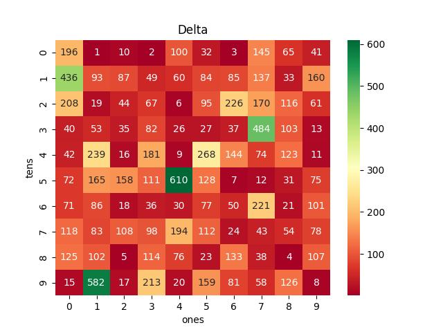
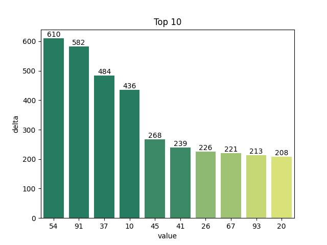
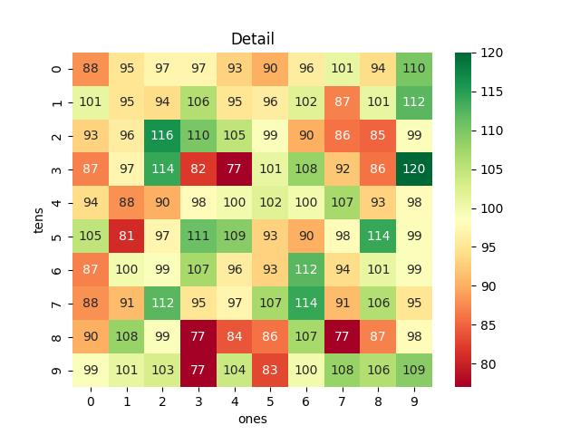
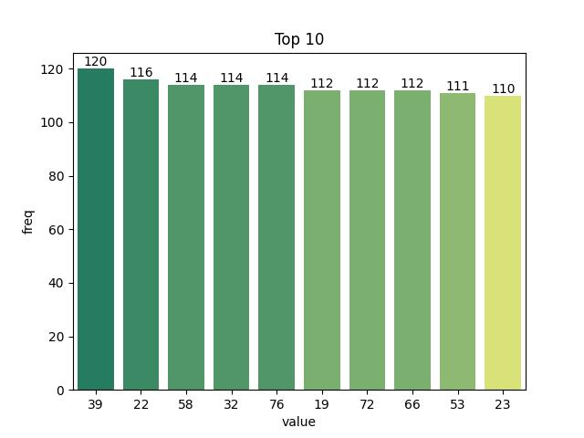
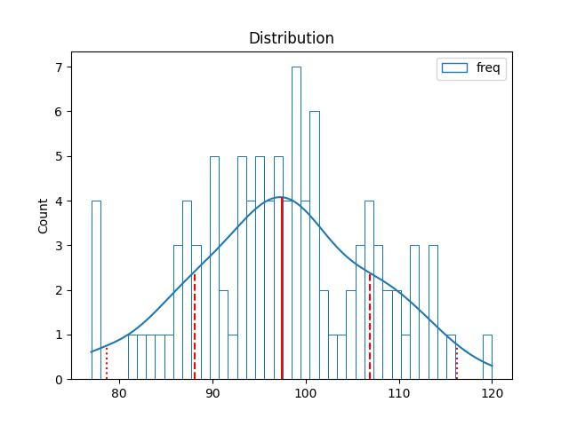
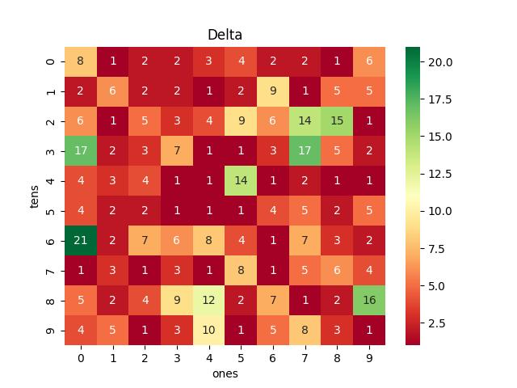
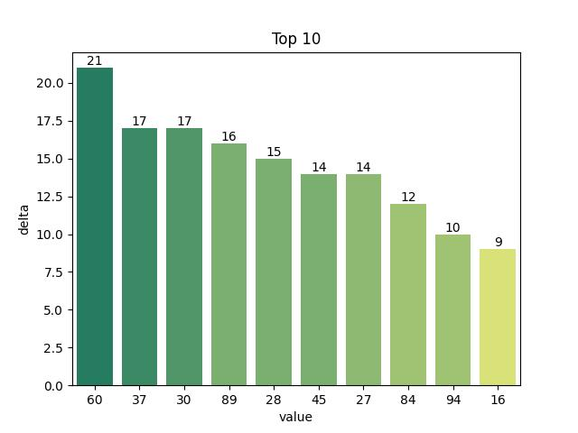

# Vietnam Lottery (XSMB) Analysis

Using GitHub Action to automatically fetch and analyze results of the Vietnam lottery daily.

Sử dụng GitHub Action để tự động hoá thu thập và phân tích kết quả xổ số hàng ngày của Việt Nam.

Download:

* [Full data](https://raw.githubusercontent.com/khiemdoan/vietnam-lottery-xsmb-analysis/main/results/xsmb.csv)
* [1-year data](https://raw.githubusercontent.com/khiemdoan/vietnam-lottery-xsmb-analysis/main/results/xsmb_1_year.csv)
* [2-year data](https://raw.githubusercontent.com/khiemdoan/vietnam-lottery-xsmb-analysis/main/results/xsmb_2_year.csv)
* [3-year data](https://raw.githubusercontent.com/khiemdoan/vietnam-lottery-xsmb-analysis/main/results/xsmb_3_year.csv)
* [5-year data](https://raw.githubusercontent.com/khiemdoan/vietnam-lottery-xsmb-analysis/main/results/xsmb_5_year.csv)

| Lottery (Xổ số) | Loto (Lô tô) |
| :------------: | :----------: |
| <table><tr><td>Date (Ngày)</td><td>22-06-2025</td></tr><tr><td>Special (Giải dặc biệt)</td><td>27301</td></tr><tr><td>First (Giải nhất)</td><td>84414</td></tr><tr><td>Second (Giải nhì)</td><td>53608, 57899</td></tr><tr><td rowspan="2">Third (Giải ba)</td><td>53334, 05692, 21955</td></tr><tr><td>08546, 70544, 19235</td></tr><tr><td>Fourth (Giải tư)</td><td>2853, 8817, 5854, 1366</td></tr><tr><td rowspan="2">Fifth (Giải năm)</td><td>5574, 7070, 5276</td></tr><tr><td>6787, 9529, 3972</td></tr><tr><td>Sixth (Giải sáu)</td><td>943, 448, 021</td></tr><tr><td>Seventh (Giải bảy)</td><td>49, 29, 95, 54</td></tr></table> | <table><tr><td>First (Đầu)</td><td>Last (Đuôi)</td></tr><tr><td>0</td><td>1, 8</td></tr><tr><td>1</td><td>4, 7</td></tr><tr><td>2</td><td>1, 9, 9</td></tr><tr><td>3</td><td>4, 5</td></tr><tr><td>4</td><td>3, 4, 6, 8, 9</td></tr><tr><td>5</td><td>3, 4, 4, 5</td></tr><tr><td>6</td><td>6</td></tr><tr><td>7</td><td>0, 2, 4, 6</td></tr><tr><td>8</td><td>7</td></tr><tr><td>9</td><td>2, 5, 9</td></tr></table> |

  
<h2>Analysis of special prices (Phân tích kết quả xổ số)</h2>

  <h3>Amount of day from last appearing (Số ngày từ lần xuất hiện cuối cùng)</h3>

  

  <h3>Top 10 amount of day from last appearing (Top 10 số lâu chưa xuất hiện)</h3>

  

  
<h2>Analysis of one-year Loto results (Phân tích kết quả lô tô trong 1 năm)</h2>

  Max: 120. Min: 77.

  Mean: 97.47. Standard deviation: 9.4.

  <h3>Detail (Chi tiết)</h3>

  

  <h3>Top 10</h3>

  

  <h3>Distribution (Phân bổ)</h3>

  

  
<h3>Amount of day from last appearing (Số ngày từ lần xuất hiện cưới cùng)</h2>

  

  <h3>Top 10 amount of day from last appearing (Top 10 số lâu chưa xuất hiện)</h3>

  

